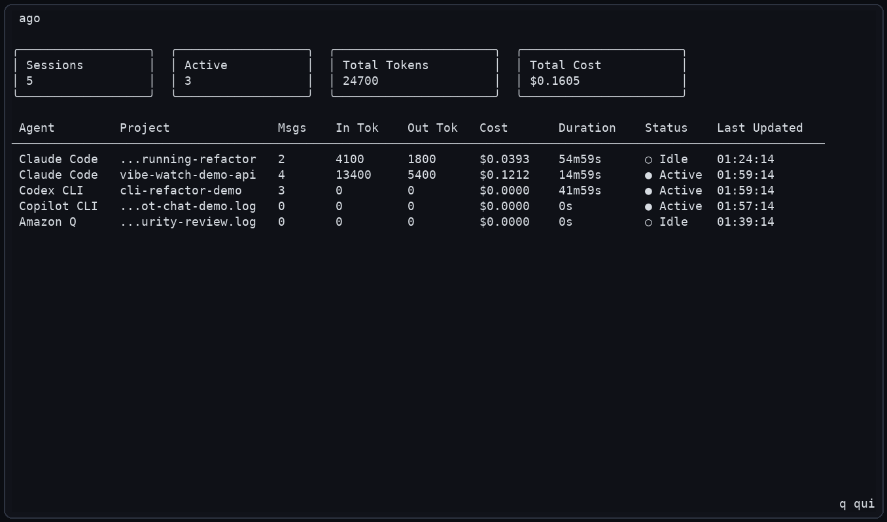
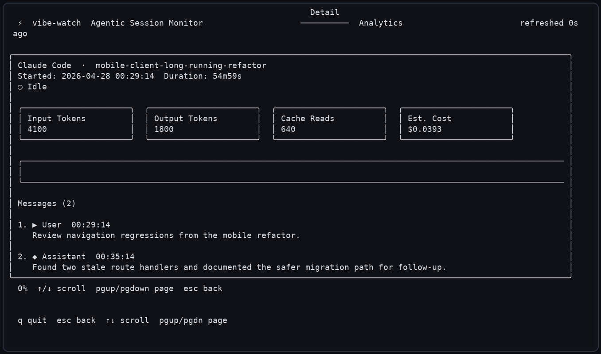
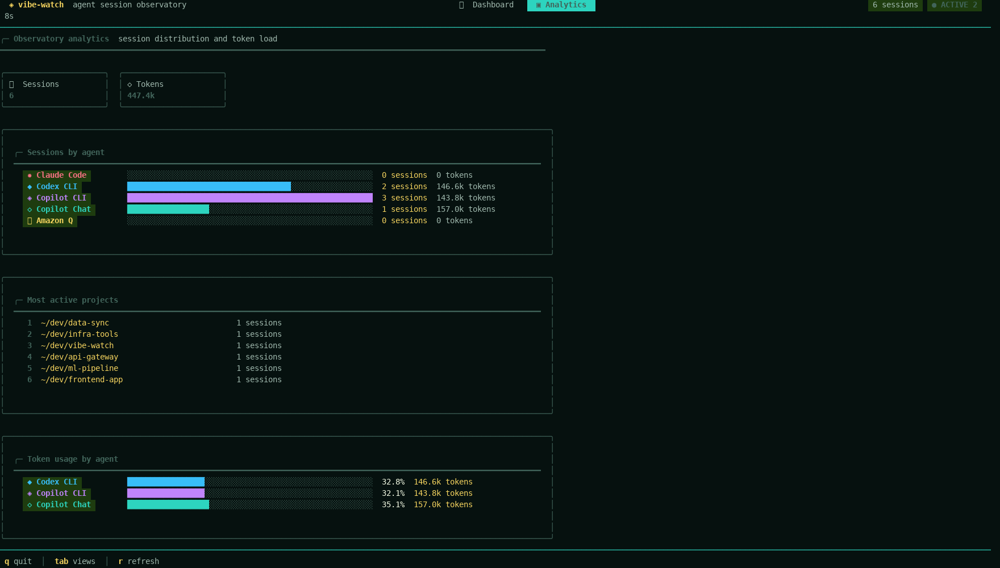

# ⚡ vibe-watch

A graphical terminal UI (TUI) for monitoring and analyzing session data from agentic coding agents and CLIs: Claude Code, Codex CLI, GitHub Copilot CLI, GitHub Copilot Chat for VS Code, and Amazon Q Developer CLI.

Run `vibe-watch` in a **separate terminal** alongside your coding agent to watch live session activity, token usage, and project-level trends without extra configuration.

## Screenshots

| Dashboard | Selected session |
|---|---|
|  |  |

| Session detail | Analytics |
|---|---|
|  |  |

Additional examples are available in [`screenshots/`](screenshots/), including scrolled detail and filtered dashboard states.

## Features

- **Real-time session monitoring** — polls every 2 seconds by default for new and updated sessions.
- **Dashboard view** — groups sessions by date and agent, with project path, message counts, input/output tokens, duration, status, and last update time.
- **Detail view** — displays the session timeline with collapsible prompt threads, focused event navigation, token details, timestamps, and follow-latest mode for active sessions.
- **Analytics view** — summarizes session totals, prompt-thread efficiency, outlier sessions, prompt categories, tool activity, refinement hints, token load, and most active projects.
- **Multi-agent support** — detects Claude Code, Codex CLI, GitHub Copilot CLI, GitHub Copilot Chat for VS Code, and Amazon Q Developer sessions.
- **Filtering** — filter by agent from the command line or by project/session text inside the TUI.
- **No config required** — reads standard local log/session locations automatically.

## Supported agents

| Agent | Log location |
|---|---|
| **Claude Code** | `~/.claude/projects/` JSONL transcripts |
| **Codex CLI** | `~/.codex/sessions/` JSONL transcripts |
| **GitHub Copilot CLI** | `~/.copilot/session-state/` session metadata and events |
| **GitHub Copilot Chat for VS Code** | VS Code `workspaceStorage/` chat sessions and transcripts |
| **Amazon Q Developer CLI** | `~/.aws/amazonq/` CLI logs |

## Installation

### From source

Requires Go 1.24.13 or newer.

```bash
git clone https://github.com/SamMRoberts/vibe-watch
cd vibe-watch
go build -o vibe-watch .
./vibe-watch
```

### Go install

```bash
go install github.com/SamMRoberts/vibe-watch@latest
```

## Usage

```bash
# Start the TUI dashboard (default command)
vibe-watch

# Explicit watch subcommand
vibe-watch watch

# Filter to a specific agent
vibe-watch watch --agent claude
vibe-watch watch --agent codex
vibe-watch watch --agent copilot
vibe-watch watch --agent chat
vibe-watch watch --agent amazonq

# Set refresh interval in seconds (default: 2)
vibe-watch watch --refresh 5
```

## Key bindings

| Key | Action |
|---|---|
| `tab` / `shift+tab` | Cycle between Dashboard, Detail, and Analytics views |
| `↑` / `↓` or `k` / `j` | Navigate rows or timeline events |
| `enter` | Open the selected session or focus a timeline item |
| `esc` | Return to the previous view |
| `r` | Force refresh |
| `/` | Filter sessions by text |
| `[` / `]` | Jump to previous/next user prompt in detail view |
| `space` | Collapse or expand the selected detail thread |
| `c` | Toggle all collapsible detail threads |
| `d` | Cycle detail density |
| `t` | Toggle timestamps in detail view |
| `f` | Follow latest activity in active sessions |
| `pgup` / `b` | Page up in detail/focused views |
| `pgdown` | Page down in detail/focused views |
| `home` / `end` | Jump to top/bottom |
| `q` / `ctrl+c` | Quit |

## Go TUI and CLI stack

vibe-watch uses a small set of focused Go libraries:

- **[Cobra](https://github.com/spf13/cobra)** powers the `vibe-watch` command tree, flags, and subcommands so the app can expose a simple default command plus explicit `watch` options.
- **[Bubble Tea](https://github.com/charmbracelet/bubbletea)** provides the TUI runtime, event loop, update model, alternate-screen mode, and keyboard/mouse handling.
- **[Bubbles](https://github.com/charmbracelet/bubbles)** supplies reusable TUI components such as tables, viewports, help bindings, and key binding helpers.
- **[Lip Gloss](https://github.com/charmbracelet/lipgloss)** renders the visual design: borders, panels, colors, responsive layout, badges, charts, and styled text.

Together these libraries keep the app portable, responsive, and easy to extend while staying entirely in Go.

## Development

```bash
# Run tests
go test ./...

# Build all packages
go build ./...

# Run vet/static checks
go vet ./...
```

## Project structure

```text
vibe-watch/
├── main.go                        # Entry point
├── cmd/
│   ├── root.go                    # Root Cobra command
│   └── watch.go                   # watch subcommand and flags
├── screenshots/                   # README and release screenshots
└── internal/
    ├── models/
    │   └── session.go             # Session, Message, TokenUsage models
    ├── agents/
    │   ├── detector.go            # AgentDetector interface and registry
    │   ├── claude.go              # Claude Code JSONL parser
    │   ├── codex.go               # Codex CLI JSONL parser
    │   ├── copilot.go             # GitHub Copilot CLI session scanner
    │   ├── copilot_chat.go        # GitHub Copilot Chat for VS Code scanner
    │   └── amazonq.go             # Amazon Q log scanner
    ├── watcher/
    │   └── watcher.go             # Polling-based session watcher
    └── tui/
        ├── app.go                 # Main Bubble Tea model
        ├── dashboard.go           # Dashboard table view
        ├── detail.go              # Session detail timeline view
        ├── analytics.go           # Analytics summary and charts
        ├── keys.go                # Key bindings and help
        └── styles.go              # Lip Gloss theme and components
```
